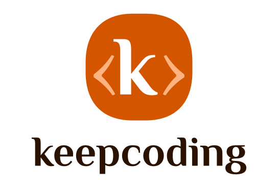

# Marca KeepCoding®

> A casa visual da KeepCoding — o repositório-fonte da marca. Tudo que sai sob o nome KeepCoding nasce daqui: símbolo, cores, tipografia e as aplicações prontas para usar.



## A marca em uma frase

Um **`k`** serifado, sereno, abraçado pelos brackets **`‹ ›`** de código, dentro de um *squircle* de laranja vivo. Engenharia com alma artesanal: a precisão do código (os brackets) encontrando o cuidado humano (a letra de tipografia clássica). É uma marca quente, direta e confiante — como a empresa que constrói o app que resolve, com IA trabalhando 24h.

## Símbolo

O sinal mínimo da marca é o **ícone**: o `k` entre brackets. Funciona sozinho em qualquer escala — de favicon a fachada. Quando há espaço e contexto, ele vem acompanhado do **wordmark** `keepcoding`.

- **Ícone** — só o símbolo. Use quando a marca já é conhecida ou o espaço é apertado (app, avatar, favicon).
- **Logo** — símbolo + wordmark. A assinatura completa, para primeiro contato e contextos institucionais.
- **Lockups** — `logo-h` (horizontal) e `logo-v` (vertical) para encaixar na proporção do suporte.

## Cores

| Papel | Hex | Onde vive |
|-------|-----|-----------|
| Laranja KeepCoding | `#e35336` | cor-mãe — squircle, destaques, energia |
| Coral | `#f0a89a` | os brackets, acentos suaves |
| Tinta | `#161213` | wordmark e o símbolo sobre fundo claro |
| Branco | `#ffffff` | o símbolo sobre cor/fundo escuro |

O laranja é o coração da marca — usado com generosidade. A tinta `#161213` é quase-preto quente, nunca preto puro: mantém o tom acolhedor mesmo no texto.

## Tipografia

**Philosopher** — a serifada que dá ao `k` (e ao wordmark) seu caráter clássico e legível. O arquivo está em [`Philosopher.zip`](Philosopher.zip). É a voz tipográfica da marca; use-a em títulos e na assinatura.

## Estrutura dos assets

A matriz oficial vive em [`brand/`](brand/), em duas variações de tema — **`light/`** e **`dark/`** — cada uma com o conjunto completo:

```
brand/
├── light/            # variação para fundos claros
│   ├── logo.svg          # símbolo + wordmark
│   ├── logo-h.svg        # lockup horizontal
│   ├── logo-v.svg        # lockup vertical
│   ├── icon.svg          # só o símbolo
│   ├── mask.svg          # silhueta monocromática (recortes, máscaras, stencil)
│   ├── creative-h.svg    # composição expressiva (horizontal)
│   └── creative-v.svg    # composição expressiva (vertical)
└── dark/             # variação para fundos escuros — mesmo conjunto
```

Na raiz, os derivados prontos para uso direto:

| Arquivo | Para que serve |
|---------|----------------|
| `logomarca.svg` / `.png` | a assinatura completa, vetorial e raster |
| `avatar.png` / `avatar-light.png` | foto de perfil (redes, apps) — sobre cor / sobre claro |
| `favicon.ico` / `favicon-light.ico` | ícone de aba do navegador |
| `wallpaper.png` / `.svg` | papel de parede da marca |
| `texture.png` | a textura laranja granulada — fundo com personalidade |
| `Philosopher.zip` | a fonte da marca |

## Como usar

- **Escolha a variação pelo fundo:** `light/` sobre claro, `dark/` sobre escuro. O símbolo precisa respirar — dê margem ao redor de pelo menos a altura do `k`.
- **Prefira SVG.** Os assets em `brand/` são vetoriais e escalam sem perda; use os PNG só onde vetor não cabe.
- **Não distorça, não recolora, não reorganize** o símbolo. A relação entre o `k`, os brackets e o squircle é fixa.
- **O laranja manda.** Quando em dúvida, deixe a marca quente.

---

*Custódia e comunicação de marca: ver a frente `marca-keepcoding` no mind da Kai. Este repositório é a fonte canônica — toda peça começa por aqui.*
